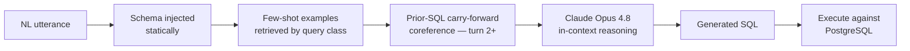
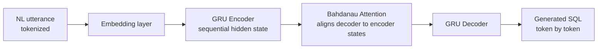
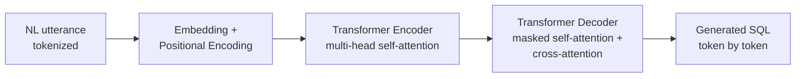

# Boston Celtics CoSQL — Conversational Text-to-SQL


**IE7500 Natural Language Processing · Northeastern University COE · Summer 2026**
Rosalina Torres · Sean Costello · Craig Hobel

---

> ☘️ Ask a basketball question in plain English. Get a PostgreSQL query back.
> Three architectures. One annotated corpus. Direct head-to-head comparison.

---

<!-- DEMO GIF — record the interactive pipeline demo and drop it here -->
<!-- Recommended: 15-second screen recording of a two-turn query → shot chart render -->
<!-- Save as docs/demo.gif and uncomment the line below -->
<!--  -->

## Project at a Glance

This project answers one question: **how do different architectures handle conversational Text-to-SQL over a spatial NBA shot-chart database?**

Three implementations solve the same task over the same annotated corpus. One uses no training at all. Two are trained from scratch. All are evaluated against execution-verified results on a live PostgreSQL database.

| Architecture | Approach | Training Data | Execution Accuracy |
|---|---|---|---|
| ☘️ Few-Shot LLM Pipeline | In-context reasoning (Claude Opus 4.8) | None — zero-shot weights | **88.5%** own (leakage-free) · **31.8%** strict / **80.0%** question-faithful cross-schema |
| GRU Encoder-Decoder | Supervised seq2seq + Bahdanau attention | 880 NL/SQL pairs | **97.3%** (paraphrase-level†) |
| Transformer | Supervised encoder-decoder | 880 NL/SQL pairs | **92.7%** (paraphrase-level†, preliminary) |

> † Every test pair's exact gold SQL appears in the training set (per-template split) — these numbers measure paraphrase robustness, not SQL generalization. See [`docs/TEMPLATE_OVERLAP.md`](docs/TEMPLATE_OVERLAP.md).
> These are not the same kind of number as each other — and that difference is the whole point.
> See [How Architectures Generalize Differently](#how-architectures-generalize-differently).

---

## The Database

NBA spatial shot-chart data stored in PostgreSQL (`nba_spatial` schema). Queries span **8 annotated classes**: zone filtering, player-level aggregation, spatial distance calculations, game-level filtering, and multi-turn coreference resolution.

> [!IMPORTANT]
> **Bug #8 — Spatial Zone Unit Mismatch (Critical)**
> `nba_api` stored `x`, `y` coordinates in **tenths-of-feet** and `shot_distance` in **whole feet** — in the same table, with no documentation. Every zone-based query returned 0 rows until caught via live execution verification. Fix: `x_coord / 10.0 AS x_ft`. Full writeup: [`docs/BUG_REPORT.md`](docs/BUG_REPORT.md#bug-8--spatial-zone-unit-mismatch-critical-annotation-bug)

---

## Three Architectures

### 1. ☘️ Few-Shot NL2SQL Pipeline — Rosalina Torres

Schema-aware in-context reasoning. No training — the model reasons over the schema and few-shot examples at inference time. Multi-turn coreference is handled by carrying prior SQL forward in the prompt.



**Key design choices:**
- Static schema injection — full table/column context in every prompt
- Few-shot examples selected by query class, not semantic similarity
- Coreference resolved by appending prior SQL to the turn 2 prompt — no separate resolver module

---

### 2. GRU Encoder-Decoder — Craig Hobel

Sequence-to-sequence model with Bahdanau attention, trained on 880 auto-generated NL/SQL pairs.



> **Preprocessing Bug (0% → 97.3%):**
> Original `preprocess_sentence()` stripped SQL syntax characters (`_`, `*`, `=`, digits, quotes) from both input *and* output during training. Fix: split into separate `preprocess_nl()` and `preprocess_sql()` functions. Execution accuracy went from 0% to 97.3% on 220-pair test set.

---

### 3. Transformer Encoder-Decoder — Sean Costello

Multi-head self-attention trained on the same 880-pair corpus.



---

## How Architectures Generalize Differently

The three diagrams above look similar — each takes an NL utterance and produces SQL — but two are trained and one isn't. That mechanical difference changes what the accuracy numbers actually measure.

**The GRU and Transformer use supervised learning.** Their training data is (NL utterance, gold SQL) pairs — the gold SQL is the label. A loss function drives gradient updates to the model's weights. The 880-pair corpus is their training set in the traditional sense: labeled examples, weights that change.

**The few-shot pipeline uses in-context learning.** Nothing in `models/few_shot_pipeline/nl2sql.py` trains anything — no loss function, no gradient updates. A handful of examples are placed inside the prompt at inference time, and the model generalizes from patterns encoded during its own pretraining. The 139-pair WOZ corpus is used for evaluation and example selection, not for weight updates.

**Why this matters for the cross-schema result:**
A supervised decoder can only emit tokens from the vocabulary its training data taught it. Feed the GRU Craig's `boxscores`/`player_boxscores` schema and it has no learned representation for column names it never saw in the 880-pair corpus. The few-shot pipeline hands the new schema to a pretrained model fresh in the prompt — a fundamentally different mechanism for handling novelty. This is why 83.2% cross-schema and 97.3% on-schema are not the same kind of number: they measure different *types* of generalization.

---

## Milestone 2 Results

> Milestone checkpoint — numbers subject to revision as evaluation continues.

| Model | Test Set | Execution Accuracy | Verified |
|---|---|---|---|
| Few-shot (Rosalina) | Own 26-pair held-out (conversation-level, leakage-free) | **88.5%** (23/26) | ✅ Audited + reproduced twice |
| Few-shot (Rosalina) | Craig's 220-pair, boxscores schema, strict matcher | **31.8%** strict (70/220) · **80.0%** question-faithful (176/220) | ✅ Audited |
| GRU (Craig) — original | Craig's 220-pair | 0% | ✅ Bug identified |
| GRU (Craig) — fixed | Craig's 220-pair (paraphrase-level†) | **97.3%** (214/220) | ✅ Independent |
| Transformer (Sean) | Craig's 220-pair (paraphrase-level†) | **92.7%** (204/220) | ⏳ Pending re-verification |

**Notes (updated after evaluation audit, 2026-07-14):**
- **Few-shot own-schema:** a previously reported 100% (28/28) was inflated by three evaluator issues — test items in the few-shot pool (leakage), follow-up turns given gold SQL instead of the model's own prediction, and a lenient numeric-fallback matcher. The corrected protocol (conversation-level split, train-only example pool, self-conditioned multi-turn, strict matching) yields 23/26 = 88.5%, reproduced twice. Details in the [individual repo](https://github.com/rosalinatorres888/nba-cosql-spatial-pipeline).
- **Few-shot cross-schema:** the previously reported 83.2% was an execution *rate* (predicted SQL ran without error) computed with the wrong schema in the prompt — not accuracy. Under strict gold-result matching with the boxscores schema: 31.8% vs gold as written. Failure taxonomy: 48.2% of "failures" are cases where the gold SQL omits a constraint the question explicitly states (e.g. "in a playoff game" with no `season_type` filter) and the model correctly adds it; 4.5% of gold queries cannot execute at all (placeholders, nonexistent tables). Counting question-faithful predictions as correct: 80.0%. Reproduce with `python evaluation/evaluate_crossschema_strict.py`.
- **† Paraphrase-level:** the shared per-template 80/20 split places every test pair's exact gold SQL string in training (verified 220/220) — see [`docs/TEMPLATE_OVERLAP.md`](docs/TEMPLATE_OVERLAP.md). A template-disjoint split is the recommended M3 addition for all three models.
- The GRU's 0% was caused by `preprocess_sentence()` stripping SQL syntax characters from both input and output. Fix: `preprocess_nl()` / `preprocess_sql()` split.
- Sean's 92.7% is self-reported in `models/transformer/README.md` and has not yet completed an independent re-run against the live DB.
- The 880-pair corpus needs curation before M3: 10/220 test gold queries are non-executable and ~48% omit question-stated constraints — this penalizes semantically-correct models and rewards memorization of flawed gold.

---

## Repository Structure

```
cosql-nba-spatial/
├── models/
│   ├── few_shot_pipeline/   # Rosalina Torres — DIN-SQL few-shot inference
│   ├── gru_seq2seq/         # Craig Hobel — GRU encoder-decoder
│   └── transformer/         # Sean Costello — Transformer encoder-decoder
├── evaluation/
│   ├── evaluate_all.py      # Side-by-side comparison of all three models
│   └── results/             # Per-model result files
├── annotation/              # 139 WOZ NL/SQL pairs across 8 query classes
├── docs/
│   ├── demo.gif             # ← drop your screen recording here
│   ├── EVALUATION_RESULTS.md
│   ├── ANNOTATION_PROTOCOL.md
│   └── BUG_REPORT.md
├── schema.sql               # PostgreSQL schema (nba_spatial)
├── requirements.txt
└── README.md
```

---

## Quickstart

```bash
git clone https://github.com/rosalinatorres888/cosql-nba-spatial.git
cd cosql-nba-spatial
pip install -r requirements.txt
```

**Database setup (required for few-shot pipeline execution accuracy):**

```bash
createdb nba_spatial
psql nba_spatial < schema.sql

cp .env.example .env
# Add ANTHROPIC_API_KEY to .env
```

**Run individual models:**

```bash
# Few-shot LLM pipeline
python models/few_shot_pipeline/nl2sql.py

# GRU Seq2Seq
python models/gru_seq2seq/train.py
python models/gru_seq2seq/evaluate.py

# Transformer
python models/transformer/train.py
python models/transformer/evaluate.py
```

**Run full side-by-side comparison:**

```bash
python evaluation/evaluate_all.py
# → Prints comparison table for all three models
```

---

## Branch Strategy

| Branch | Owner | Purpose |
|---|---|---|
| `main` | Protected | Reviewed, passing code only |
| `rosalina/pipeline` | Rosalina Torres | Few-shot LLM pipeline |
| `craig/gru` | Craig Hobel | GRU encoder-decoder |
| `sean/transformer` | Sean Costello | Transformer baseline |

All merges to `main` require a pull request. No direct pushes to `main`.

---

## Team Contributions

| Contributor | Contributions |
|---|---|
| **Rosalina Torres** | Conversational pipeline · coreference resolution · WOZ annotation corpus (139 pairs, 8 query classes) · evaluation framework · cross-model evaluation · cross-schema test · documentation |
| **Sean Costello** | Transformer encoder-decoder baseline |
| **Craig Hobel** | GRU encoder-decoder baseline · preprocessing bug fix (0% → 97.3%) |

---

## References

- Pourreza & Rafiei (2023). [DIN-SQL: Decomposed In-Context Learning of Text-to-SQL.](https://arxiv.org/abs/2304.11498) *NeurIPS 2023.*
- Yu et al. (2019). [CoSQL: A Conversational Text-to-SQL Challenge.](https://arxiv.org/abs/1909.05378) *EMNLP 2019.*
- Sutskever et al. (2014). [Sequence to Sequence Learning with Neural Networks.](https://arxiv.org/abs/1409.3215) *NeurIPS 2014.*
- Bahdanau et al. (2015). [Neural Machine Translation by Jointly Learning to Align and Translate.](https://arxiv.org/abs/1409.0473) *ICLR 2015.*
