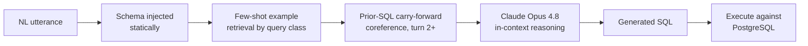
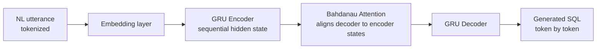
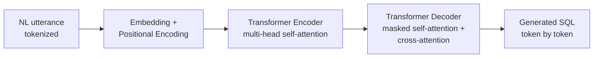

# Boston Celtics — Conversational Text-to-SQL (CoSQL)


**IE7500 Natural Language Processing · Northeastern University COE · Summer 2026**

Team: Rosalina Torres · Sean Costello · Craig Hobel

---

This project investigates multiple architectural approaches for conversational Text-to-SQL over an NBA spatial shot-chart database. The primary implementation is a CoSQL-inspired conversational pipeline that combines schema-aware prompting, few-shot in-context learning, spatial reasoning, and multi-turn coreference resolution. To provide comparative baselines, the project also implements two neural sequence-generation architectures: (1) a GRU encoder-decoder with Bahdanau attention and (2) a Transformer encoder-decoder, both trained on the same annotated corpus. All architectures are evaluated against a common execution-verified dataset, enabling direct comparison using SQL validity, execution accuracy, and BLEU-4.

---

## Three Architectures

Three different architectures solve the same conversational Text-to-SQL task over the same annotated corpus: a few-shot LLM pipeline (no training), a GRU encoder-decoder with Bahdanau attention (trained), and a Transformer encoder-decoder (trained).

### Few-Shot NL2SQL Pipeline — Rosalina Torres

Schema-aware, in-context reasoning. No training or fine-tuning — the model reasons over the schema and few-shot examples at inference time, with prior-SQL carry-forward handling multi-turn coreference.



### GRU Encoder-Decoder — Craig Hobel

Sequence-to-sequence model with Bahdanau attention, trained on 880 auto-generated NL/SQL pairs.



### Transformer — Sean Costello

Transformer encoder-decoder with multi-head attention, trained on the same 880-pair corpus.



### Supervised Learning vs. In-Context Learning

The three diagrams above look similar at a glance — each takes an NL utterance and produces SQL — but two of them are trained and one isn't, and that difference is mechanical, not just a labeling choice.

**Craig's GRU and Sean's Transformer are supervised learning.** Training data is (NL utterance, gold SQL) pairs — the gold SQL is the label. The decoder predicts a token, is shown the correct token (teacher forcing), and a loss function measured against that label drives gradient updates to the model's weights. The 880-pair corpus is their training set in the traditional sense: labeled examples, a loss function, weights that change.

**The few-shot pipeline is in-context learning, not supervised learning.** Nothing in `models/few_shot_pipeline/nl2sql.py` trains anything — no loss function, no gradient updates, no weights adjusted from this project's data. A handful of examples are shown to a pretrained model (Claude) *inside the prompt itself* at inference time, and it generalizes from patterns already encoded during its own pretraining. The 139-pair WOZ corpus here is used for evaluation and for selecting which 3 examples go into the prompt — not for training weights.

**Why this matters for the cross-schema result:** a supervised decoder can only emit tokens from the vocabulary its training data taught it. Feed the GRU or Transformer an unseen schema (Craig's `boxscores`/`player_boxscores` tables) and it has no learned representation for column names it never saw in the 880-pair corpus. The few-shot pipeline instead relies on the underlying pretrained model's general SQL fluency, with the new schema handed to it fresh in the prompt each time — a different mechanism for handling novelty. This is why the 83.2% cross-schema result and the training-vocabulary constraint on the other two aren't really the same kind of number, and why comparing them is about *how* each generalizes, not just which score is higher.

---

## Milestone 2 — Observed Results

These are the results observed so far. This is a milestone checkpoint, not the final report — numbers below are subject to change as evaluation continues.

| Model | Test Set | Execution Accuracy | Status |
|---|---|---|---|
| Few-shot NL2SQL (Rosalina) | Own 28-pair held-out set | **100%** (28/28) | Verified |
| Few-shot NL2SQL (Rosalina) | Craig's 220-pair set, cold (unseen schema, no retraining) | **83.2%** (183/220) | Verified |
| GRU encoder-decoder (Craig) — original | Own 220-pair test set | 0% | Verified (bug identified) |
| GRU encoder-decoder (Craig) — fixed | Own 220-pair test set | **97.3%** (214/220) | Verified |
| Transformer (Sean) | Craig's 220-pair set | **92.7%** (204/220) | Preliminary — pending independent verification |

**Notes:**
- The GRU's original 0% was caused by `preprocess_sentence()` stripping SQL syntax characters (`_`, `*`, `=`, digits, quotes) from both input and output. Fix: split into `preprocess_nl()` and `preprocess_sql()`.
- The few-shot pipeline's 83.2% figure is on Craig's schema (`boxscores`/`player_boxscores`), which the pipeline was not built against — no retraining or prompt changes were made for this test.
- Sean's 92.7% is self-reported in `models/transformer/README.md` and has not yet gone through the same independent re-verification pass (re-run against the live DB) that Craig's fixed number did.

### Bug #8 — Spatial Zone Unit Mismatch

A finding from the few-shot pipeline's execution-verification process, unrelated to any model architecture — rooted in the `nba_api` data source itself:

> A hidden inconsistency in the nba_api endpoint stored x, y in tenths-of-feet and distance in whole feet — in the same table. Every zone-based query returned 0 results until the bug was caught via live execution verification.

Full writeup, root cause, and verified row counts post-fix: [`docs/BUG_REPORT.md`, Bug 8](docs/BUG_REPORT.md#bug-8--spatial-zone-unit-mismatch-critical-annotation-bug).

---

## Repository Structure

```
├── models/
│   ├── few_shot_pipeline/   # Rosalina Torres — DIN-SQL few-shot inference
│   ├── gru_seq2seq/         # Craig Hobel — GRU encoder-decoder baseline
│   └── transformer/         # Sean Costello — Transformer encoder-decoder baseline
├── evaluation/
│   ├── evaluate_all.py      # Run all three models, print comparison table
│   └── results/             # Per-model result files
├── annotation/              # 139 WOZ NL/SQL pairs across 8 query classes
├── docs/
│   ├── EVALUATION_RESULTS.md
│   ├── ANNOTATION_PROTOCOL.md
│   └── BUG_REPORT.md
├── schema.sql               # PostgreSQL schema (nba_spatial)
├── requirements.txt
└── README.md
```

---

## Quickstart

```bash
git clone https://github.com/rosalinatorres888/cosql-nba-spatial.git
cd cosql-nba-spatial
pip install -r requirements.txt
```

### Run individual models

```bash
# Few-shot LLM pipeline (requires ANTHROPIC_API_KEY)
python models/few_shot_pipeline/nl2sql.py

# GRU Seq2Seq baseline
python models/gru_seq2seq/train.py
python models/gru_seq2seq/evaluate.py

# Transformer baseline
python models/transformer/train.py
python models/transformer/evaluate.py
```

### Run full comparison evaluation

```bash
python evaluation/evaluate_all.py
```

Prints a side-by-side results table for all three models.

---

## Environment Setup

```bash
# PostgreSQL (required for few-shot pipeline execution accuracy)
createdb nba_spatial
psql nba_spatial < schema.sql

# Environment variables
cp .env.example .env
# Set ANTHROPIC_API_KEY in .env
```

---

## Branch Strategy

| Branch | Owner | Purpose |
|---|---|---|
| `main` | Protected | Reviewed, passing code only |
| `rosalina/pipeline` | Rosalina Torres | Few-shot LLM pipeline |
| `craig/gru` | Craig Hobel | GRU encoder-decoder |
| `sean/transformer` | Sean Costello | Transformer baseline |

All merges to `main` require a pull request. No direct pushes to `main`.

---

## Team Contributions

- **Rosalina Torres** — conversational pipeline, coreference resolution, WOZ annotation corpus (139 pairs), evaluation framework, cross-model evaluation, documentation
- **Sean Costello** — Transformer encoder-decoder baseline
- **Craig Hobel** — GRU encoder-decoder baseline, preprocessing bug fix (0% → 97.3%)

---

## References

- Pourreza & Rafiei (2023). DIN-SQL: Decomposed In-Context Learning of Text-to-SQL. *NeurIPS 2023*.
- Yu et al. (2019). CoSQL: A Conversational Text-to-SQL Challenge. *EMNLP 2019*.
- Sutskever et al. (2014). Sequence to Sequence Learning with Neural Networks. *NeurIPS 2014*.
- Bahdanau et al. (2015). Neural Machine Translation by Jointly Learning to Align and Translate. *ICLR 2015*.
