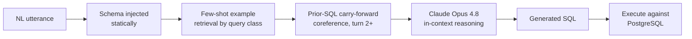

# Few-Shot LLM Pipeline (Rosalina Torres)

DIN-SQL-style conversational NL→SQL inference using Claude Opus 4.8 — schema-aware, in-context reasoning with multi-turn coreference resolution. No training or fine-tuning.

---

## Architecture



- Schema-aware few-shot prompting (DDL format)
- k=3 in-context examples selected by query class keyword matching
- Multi-turn coreference resolution via prior-SQL carry-forward
- Spatial predicate grounding (court zone coordinate ranges)

---

## Results

| Test Set | N | Execution Accuracy |
|---|---|---|
| WOZ held-out (own schema) | 28 | **100% (28/28)** |
| GRU test set (cold, unseen schema) | 220 | **83.2% (183/220)** |

---

## In-Context Learning, Not Supervised Learning

This pipeline doesn't train on this project's data. There's no loss function, no gradient updates, no weights adjusted from the 139-pair WOZ corpus — that corpus is used for evaluation and for selecting which 3 examples go into the prompt, not for training. The model reasons at inference time from a pretrained foundation model's existing SQL fluency, with the schema handed to it fresh in the prompt each time.

That's the mechanism behind the 83.2% cross-schema result: it's not testing memorization of this project's schema, it's testing whether in-context reasoning transfers to a schema (`boxscores`/`player_boxscores`) the pipeline was never built against.

---

## Finding: Bug 8 — Spatial Zone Unit Mismatch

Caught via this pipeline's execution-verification process during WOZ annotation — unrelated to the model architecture itself, rooted in the `nba_api` data source:

> A hidden inconsistency in the nba_api endpoint stored x, y in tenths-of-feet and distance in whole feet — in the same table. Every zone-based query returned 0 results until the bug was caught via live execution verification.

Every candidate SQL pair in this pipeline's annotation process is executed against the live database before being accepted — that's what surfaced this. Full writeup: [`docs/BUG_REPORT.md`, Bug 8](../../docs/BUG_REPORT.md#bug-8--spatial-zone-unit-mismatch-critical-annotation-bug).

---

## Run

```bash
# Single query
python models/few_shot_pipeline/nl2sql.py

# Evaluation (requires PostgreSQL nba_spatial)
python models/few_shot_pipeline/evaluate.py
```

## Files

- `nl2sql.py` — inference pipeline
- `evaluate.py` — execution accuracy evaluator
